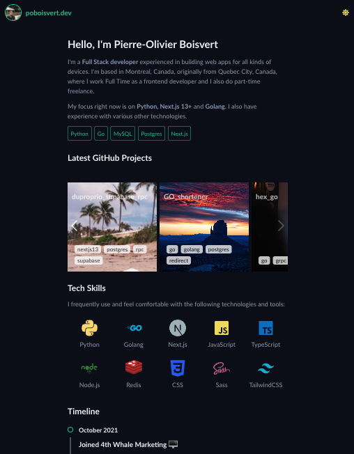

# Next.js Portfolio 📚

Welcome to my Next.js portfolio, a showcase of my skills and experience as a software engineer. This portfolio is built using Next.js, a popular React-based framework for building server-rendered, statically generated, and performance-optimized websites and applications.



## Features 🚀

- Responsive design for optimal user experience on various devices
- Server-side rendering for improved SEO and performance
- Statically generated pages for fast page loads
- Custom theme switching for a personalized experience

## Technologies Used

- Next.js for building the application
- React for building reusable UI components
- TypeScript for type safety and code maintainability
- CSS-in-JS for styling and layout management

## Getting Started

To run this portfolio locally, clone the repository and install the dependencies using `npm install` or `yarn install`. Then, start the development server using `npm run dev` or `yarn dev`.

## .env.local

```
NEXT_SENDGRID_API_KEY=SG.ABC

```

## Contact Me

If you have any questions or would like to discuss potential projects, feel free to reach out to me at [Your Email Address](mailto:your_email_address).

# Sources

- https://hangindev.com/blog/avoid-flash-of-default-theme-an-implementation-of-dark-mode-in-react-app
- https://robkendal.co.uk/blog/how-to-build-a-multi-image-carousel-in-react-and-tailwind/
